# Factory X - Entity Relationship Diagram (ERD)

```mermaid
erDiagram
    %% 사용자 및 회사 관련
    User {
        int id
        string username
        string email
        string status
        int company_id
        boolean is_staff
        boolean is_superuser
        datetime date_joined
    }
    
    Company {
        int id
        string name
        string business_registration_number
        string ceo_name
        string contact
        string business_type
        string business_item
        string address
    }
    
    Jwt {
        int id
        int user_id
        text access
        text refresh
    }
    
    %% 공통 모델
    Unit {
        int id
        string code
        string name
        text description
        boolean is_active
    }
    
    Memo {
        int id
        string memo_type
        string title
        text content
        datetime created_at
        datetime updated_at
    }
    
    %% 자재 관리
    Material {
        int id
        string name
        string code
        string specification
        string unit
        int current_stock
        int min_stock
        date expiration_date
        date received_date
        string warehouse_location
    }
    
    %% 품목 관리
    Item {
        int id
        string name
        string code
        string specification
        string unit
        int current_stock
        date expiration_date
        date received_date
        string warehouse_location
    }
    
    ItemMaterial {
        int id
        int item_id
        int material_id
        int quantity
    }
    
    Return {
        int id
        int item_id
        int return_quantity
        date return_date
    }
    
    %% 설비 관리
    Equipment {
        int id
        string status
        string name
        string type
        string location
        text special_notes
    }
    
    EquipmentItem {
        int id
        int equipment_id
        int item_id
        float production_time_per_unit
    }
    
    %% 프로젝트 관리
    Project {
        int id
        string status
        date execution_date
        date due_date
        date completed_date
    }
    
    ProjectItem {
        int id
        int project_id
        int item_id
        int equipment_id
        string operation_status
    }
    
    %% 견적 요청 관리
    Contact {
        int id
        string company_name
        string business_registration_number
        string ceo_name
        string business_type
        string business_item
        string company_address
        string manager_name
        string manager_email
        string manager_phone
        string manager_fax
        text memo
    }
    
    QuotationRequest {
        int id
        int contact_id
        date due_date
        date created_at
        string status
    }
    
    QuotationRequestItem {
        int id
        int quotation_request_id
        string item_name
        string item_code
        string specification
        string unit
        int unit_price
        int quantity
        int amount
    }
    
    %% 문서 관리 (구현 예정)
    Order {
        int id
    }
    
    ProductionInstruction {
        int id
    }
    
    TransactionStatement {
        int id
    }
    
    SalesTaxInvoice {
        int id
    }
    
    PurchaseTaxInvoice {
        int id
    }
    
    %% 관계 정의
    Company ||--o{ User : "has"
    User ||--|| Jwt : "has"
    
    Item ||--o{ ItemMaterial : "uses"
    Material ||--o{ ItemMaterial : "used_in"
    
    Item ||--o{ Return : "has_returns"
    
    Equipment ||--o{ EquipmentItem : "can_produce"
    Item ||--o{ EquipmentItem : "produced_by"
    
    Project ||--o{ ProjectItem : "contains"
    Item ||--o{ ProjectItem : "used_in_project"
    Equipment ||--o{ ProjectItem : "used_in_project"
    
    Contact ||--o{ QuotationRequest : "makes"
    QuotationRequest ||--o{ QuotationRequestItem : "contains"
```

## 주요 관계 설명

### 1. 사용자 관리
- **User ↔ Company**: 1:N 관계 (한 회사에 여러 사용자)
- **User ↔ Jwt**: 1:1 관계 (사용자당 하나의 JWT 토큰)

### 2. 제조 관계
- **Item ↔ Material**: M:N 관계 (ItemMaterial 중간 테이블)
  - 하나의 품목은 여러 자재로 만들어짐
  - 하나의 자재는 여러 품목에 사용됨
  - ItemMaterial에서 필요 수량 관리

### 3. 설비 관계
- **Equipment ↔ Item**: M:N 관계 (EquipmentItem 중간 테이블)
  - 하나의 설비는 여러 품목 생산 가능
  - 하나의 품목은 여러 설비에서 생산 가능
  - EquipmentItem에서 단위당 생산시간 관리

### 4. 프로젝트 관리
- **Project ↔ Item**: M:N 관계 (ProjectItem 중간 테이블)
- **Project ↔ Equipment**: M:N 관계 (ProjectItem 중간 테이블)
- ProjectItem에서 가동상태 관리

### 5. 견적 요청
- **Contact ↔ QuotationRequest**: 1:N 관계
- **QuotationRequest ↔ QuotationRequestItem**: 1:N 관계

### 6. 기타
- **Item ↔ Return**: 1:N 관계 (품목별 반품 이력)
- **BaseModel**: Memo가 상속받아 created_at, updated_at 자동 관리

## 데이터 흐름
1. **제조 흐름**: Material → Item (ItemMaterial로 연결)
2. **생산 흐름**: Item → Equipment → Project (생산 계획)
3. **영업 흐름**: Contact → QuotationRequest → QuotationRequestItem
4. **재고 관리**: Item stock, Material stock, Return 관리
